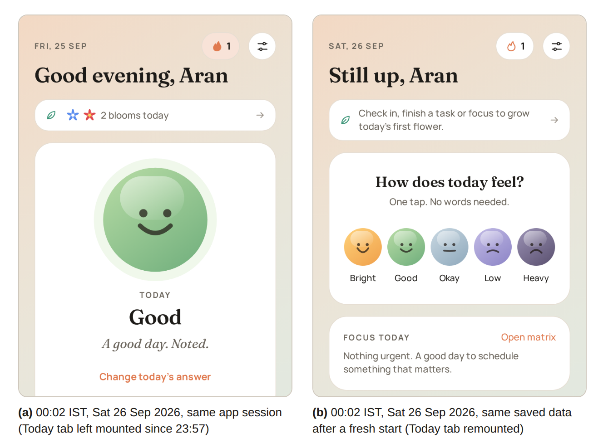

# Daybloom Mobile App: Technical Audit

**Version:** 1.0 (25 September 2026)
**Audited code:** `main` at commit `874e4b1` (25 September 2026), app version 1.4.1 (Android `versionCode` 9)
**Platform:** Expo SDK 57.0.25, React Native 0.86.3, React 19.2.3, TypeScript 6.0.3, Android target SDK 36
**Note:** Line references in Sections 1 to 7 refer to commit `874e4b1`. Appendix B re-checks the findings against `main` at `567083f`, which added backup and restore after the audit began.

---

## 1. Summary

**Purpose.** To assess the correctness, safety, privacy, security, accessibility and release readiness of the Daybloom app before its Play Store release.

**Method.** All 64 TypeScript files (8,867 lines) in `src/` and `index.ts` were read. Automated checks (TypeScript, ESLint, expo-doctor, npm audit) were run. The Android manifest produced by `expo prebuild`, the React Compiler output and the exported Android release bundle were inspected. Suspected defects were reproduced with a Node.js test script that runs the real state store, and with Playwright against the web build under a controlled clock.

**Results.** The code base typechecks and lints without errors and passes all 21 expo-doctor checks. Thirty-three findings were recorded: one Critical, four High, thirteen Medium and fifteen Low (Table 3). The Critical defect makes the Today screen keep showing the previous day after midnight while the app remains in memory; in that state a Heavy check-in is saved but the Tele-MANAS support card is not shown (Fig. 1; Appendix A, run 3). The High findings concern duplicate buddy nudges, queued nudges that wait until the app is reopened, test APKs signed with a publicly available key, and Android backup contradicting the app's privacy statements.

**Update for `main` at 567083f (Appendix B).** The backup and restore feature resolves M9 and makes Android backup a deliberate choice, but the privacy statements still contradict it (H3). C1 and H1 persist unchanged. One new Medium finding (N1: restore accepts files that stop the app from starting) and one new Low finding (N2) are recorded.

**Priority actions.** (1) Hold "today" in state so that it changes at midnight (C1). (2) Make the nudge idempotent, time-limited and retried from the widget handler (H1, H4). (3) Sign release APKs with a private key (H2). (4) Decide on Android backup and align every privacy statement (H3, M6). (5) Add unit tests and a pull-request CI job (M12).

## 2. Scope and Method

*Table 1. Methods, tools and what each established.*

| Method | Tool and version | Established |
|---|---|---|
| Source review | Manual reading of every file in `src/`, `index.ts`, `app.json`, `eas.json`, CI workflow, `docs/` | Logic, privacy and accessibility defects; claims in README and store listing |
| Typecheck and lint | `tsc --noEmit` (TypeScript 6.0.3); `expo lint` (eslint-config-expo 57.0.2) | Build health |
| Dependency health | expo-doctor 1.20.4; `npm audit` (npm 10.9.7, Node 22.22.2) | SDK alignment, known advisories |
| Native configuration | `expo prebuild --platform android` in a scratch copy | Final permissions, backup flag, signing configuration, target SDK |
| Compiler behaviour | babel-plugin-react-compiler 1.0.0 with Expo's options; `expo export --platform android` | Which render-time values are cached |
| Behavioural reproduction | Node.js test script around the real `src/lib` modules with a delayed `fetch` | Nudge, task and focus-session defects (Appendix A) |
| End-to-end reproduction | Playwright 1.56.1 (Chromium) on `expo export --platform web`, clock set to 23:57 IST | Midnight defect and its effect on the support card (Fig. 1) |

**Not assessed.** No physical Android or iOS device was used, so widget rendering, notification timing, TalkBack output and large-font layouts are listed as device tests in Section 6. The join page and privacy policy live in the website repository and were not reviewed. iOS release readiness was not assessed.

**Severity scale.** *Critical*: the core check-in or a safety path fails in a realistic situation. *High*: the nudge, private data or the release channel is affected. *Medium*: wrong behaviour in a secondary path, an inaccurate claim, or an accessibility failure. *Low*: edge cases, polish and maintainability.

## 3. Results

### 3.1 Automated checks

*Table 2. Automated check results on commit 874e4b1.*

| Check | Result |
|---|---|
| `npx tsc --noEmit` | Pass, 0 errors |
| `npx expo lint` | Pass, 0 problems |
| `npx expo-doctor` | 21 of 21 checks passed |
| `npm audit` | 15 moderate, 0 high, 0 critical; all transitive through Expo packages (see L12) |
| Secrets scan (`git grep` for keys, tokens, private keys) | None found |

### 3.2 Findings register

*Table 3. All findings, in priority order. Paths are relative to the repository root.*

| ID | Severity | Area | Finding | Location |
|---|---|---|---|---|
| C1 | Critical | Correctness, safety | Today screen keeps the day it first rendered; after midnight the picker is hidden and the Heavy-day support card does not appear | `src/app/(tabs)/today.tsx:37`, `:55`, `:79` |
| H1 | High | Nudge | The buddy can receive two nudges for one low period | `src/lib/store.ts:234-257` |
| H2 | High | Security | GitHub Release APKs are signed with the public Expo debug key | `.github/workflows/android-apk.yml` |
| H3 | High | Privacy | Android Auto Backup copies all app data to Google Drive, contrary to "never leave the phone" | `app.json` (no `allowBackup`) |
| H4 | High | Nudge | A nudge queued while offline is retried only when the app is opened; Today says the buddy was asked even while it is queued | `src/app/_layout.tsx:34-42`, `src/app/(tabs)/today.tsx:39` |
| M1 | Medium | Rewards | Rare-flower odds are about half the documented values; an empty pool can throw | `src/lib/flowers.ts:45-46` |
| M2 | Medium | Focus timer | End-of-session alarm is inexact on Android 12 and later | `src/lib/reminders.ts:62-74` |
| M3 | Medium | Data loss | "Clear all completed" in one quadrant deletes finished tasks in all four, without confirmation | `src/lib/store.ts:309-311` |
| M4 | Medium | Reach out | Any 10-digit number is treated as Indian (+91) for WhatsApp | `src/lib/reach.ts:15-20` |
| M5 | Medium | Safety | Crisis numbers (Tele-MANAS 14416, 112) are India-only but shown to every user | `src/app/(tabs)/today.tsx:423-445` |
| M6 | Medium | Privacy copy | "Never told why" contradicts the invite text, which tells the buddy what a nudge means | `src/lib/invite.ts:9` |
| M7 | Medium | Privacy | ntfy.sh topics are public; the topic travels in the invite link; join status depends on a 12-hour cache | `src/lib/ntfy.ts:24-26`, `:68-78` |
| M8 | Medium | Permissions | Release manifest carries `SYSTEM_ALERT_WINDOW` and legacy storage permissions that the app does not use | `app.json:28` |
| M9 | Medium | Data | No export or import; data is lost on uninstall and when moving from a test APK to the Play build | (absent) |
| M10 | Medium | Accessibility | Muted and accent text below WCAG AA contrast; segmented choices and task checkboxes lack roles, states or labels | `src/constants/theme.ts`, `src/components/ui.tsx:188-218`, `src/components/tasks.tsx:44-66` |
| M11 | Medium | Reminders | Reminder stays "on" when notification permission is denied | `src/app/onboarding.tsx:45-49`, `src/app/settings.tsx:33-43` |
| M12 | Medium | Process | No automated tests; CI never typechecks, lints or tests | `.github/workflows/android-apk.yml` |
| M13 | Medium | Play release | Health apps declaration is missing from the launch checklist | `docs/daybloom_store-listing_v1.md` |
| L1–L15 | Low | Various | See Table 5 | |

### 3.3 Critical and High findings

#### C1. Today screen keeps the day it first rendered (Critical)

**Evidence.** `app.json:193` enables the React Compiler. The compiler caches values that have no reactive inputs. In the compiled `Today` component the day key is computed once per mounted instance:

```js
if ($[3] === Symbol.for("react.memo_cache_sentinel")) {
  t2 = (0, _libDates.dayKey)();   // exported Android release bundle
```

The same happens to `prettyDate(new Date())` (`today.tsx:55`) and `greeting()` (`today.tsx:79`). The Today tab stays mounted, so these values stay fixed until the component mounts again, which normally means a restart of the app process. Fig. 1 shows the result with the web build and a controlled clock: after a "Good" check-in at 23:57 IST, the screen at 00:02 still reads "FRI, 25 SEP", "Good evening" and "Today: Good", and the mood picker is hidden (Fig. 1a). A fresh start with the same saved data shows the correct day and the picker (Fig. 1b). When "Heavy" was then recorded at 00:02 in the running session, storage held `{ "2026-09-25": 4, "2026-09-26": 1 }`, yet the screen still showed "Good" and the Tele-MANAS card was absent; after a fresh start the card appeared (Appendix A, run 3).



*Fig. 1. Today tab at 00:02 IST on 26 September 2026 after a "Good" check-in at 23:57 on 25 September. (a) Same app session: previous day's date, greeting, mood and bloom count; mood picker hidden. (b) Same saved data after a fresh start: correct day and mood picker. Web build of commit 874e4b1, Chromium 1194 via Playwright 1.56.1, viewport 390 × 844.*

**Impact.** Anyone whose app stays in memory overnight (for example, a check-in after the default 9 PM reminder and a return the next morning) is shown yesterday's answer as today's and is not offered the picker. The Heavy-day support card (`today.tsx:144`), the Low-day reach-out card (`today.tsx:160`) and the shortened low-day focus list (`today.tsx:162`) are evaluated against the wrong day. React requires render to be idempotent and names `new Date()` in render as a violation (React, n.d.). The same pattern leaves smaller stale values in `TodayBlooms` (`today.tsx:198`), `WeekStrip` (`today.tsx:396`), the Focus tab's "today" count (`src/app/(tabs)/focus.tsx:137`), the quadrant screen (`src/app/quadrant/[q].tsx:26`) and the name shown in the Circle tab (`src/app/(tabs)/circle.tsx:125`).

**Remedy.** Keep the day in state and refresh it at midnight and whenever the app returns to the foreground, then pass it to child components and derive the date label and greeting from it:

```ts
// src/hooks/use-today.ts
export function useToday(): string {
  const [today, setToday] = useState(dayKey);
  useEffect(() => {
    let timer: ReturnType<typeof setTimeout> | undefined;
    const refresh = () => {
      setToday(dayKey());
      const now = new Date();
      const midnight = new Date(now.getFullYear(), now.getMonth(), now.getDate() + 1);
      if (timer) clearTimeout(timer);
      timer = setTimeout(refresh, midnight.getTime() - now.getTime() + 1000);
    };
    refresh();
    const sub = AppState.addEventListener('change', (s) => s === 'active' && refresh());
    return () => {
      if (timer) clearTimeout(timer);
      sub.remove();
    };
  }, []);
  return today;
}
```

In the Circle tab, read the user's name through `useAppState` instead of `getState()` in render. Add a test that advances the clock past midnight.

#### H1. The buddy can receive two nudges for one low period (High)

**Evidence.** With the real store module and a 1.5 s network delay (Appendix A, run 1): (a) Low, then Heavy 0.2 s later, sent **two** nudges (any change of answer while the request is open has the same effect); (b) Low, Okay, Low on the same day sent **two**; (c) two foreground events with one queued nudge sent **two**.

**Cause.** `recordMood` clears `armed` only after `await sendNudge(...)` returns (`store.ts:245-247`), so a second answer during the request passes the rule again. Any Okay-or-better answer re-arms at once (`store.ts:238`), including a changed answer on the same day. `flushQueued` has no in-flight guard (`store.ts:252-257`). `fetch` has no timeout (`src/lib/ntfy.ts:34-45`), so a stalled request keeps the rule armed; home-screen check-ins run the same path in a background task with a 30 s limit (react-native-android-widget `RNWidgetBackgroundTaskWorker`), and each tap on a widget mood starts another such task.

**Impact.** Breaks the promise "One nudge per rough patch" (`circle.tsx:127`) and design decision "Prevents repeated alerts and buddy fatigue" (`docs/daybloom_app-plan_v1.md`, Table 1), and makes the signal more conspicuous to the buddy.

**Remedy.** Disarm and log the nudge as `queued` synchronously before the request, then mark it `sent`. Re-arm only on a later calendar day that is Okay or better (store the day of the last nudge). Keep one in-flight promise for `flushQueued`. Abort `fetch` after about 10 s with `AbortController`. Cover the three sequences with unit tests.

#### H2. GitHub Release APKs are signed with the public Expo debug key (High)

**Evidence.** The workflow runs `./gradlew assembleRelease` after `expo prebuild`. In the generated `android/app/build.gradle` the release build type uses `signingConfigs.debug` with `debug.keystore`, alias `androiddebugkey`, password `android`, SHA-1 `5E:8F:16:06:2E:A3:CD:2C:4A:0D:54:78:76:BA:A6:F3:8C:AB:F6:25`. That file is byte-identical (SHA-256 `221e0a31…9f5e58`) to the keystore inside the public `expo` npm package (`node_modules/expo/template.tgz`).

**Impact.** Android installs an update when its signing certificate matches the installed app (Android Developers, n.d.-a). Anyone can therefore build an APK that installs over a tester's copy of `online.draran.daybloom` and reads its stored moods, circle names and phone numbers, and the buddy topic. The README invites real users to install these builds. The same key also blocks the path from test build to Play build: the certificates differ, so users must uninstall and lose their data (see M9). Android documentation notes that the debug certificate "is insecure by design" (Android Developers, n.d.-a).

**Remedy.** Generate a private release keystore, store it in GitHub Actions secrets and sign `assembleRelease` with it, or produce the preview APK with `eas build --profile preview`, which manages credentials. Consider a separate package name for test builds (for example `online.draran.daybloom.preview`) and tell current testers.

#### H3. Android backup copies app data off the phone (High)

**Evidence.** `app.json` does not set `android.allowBackup`; the generated manifest contains `android:allowBackup="true"` with no exclusion rules. Expo's SDK 57 reference states that this property "allows your user's app data to be automatically backed up to their Google Drive", defaults to `true`, and that `false` "is useful if your app deals with sensitive information" (Expo, n.d.-a). All app data sits in the expo-sqlite key-value database under `filesDir/SQLite` (`expo-sqlite` `SQLiteModule.kt:35-36`), and Auto Backup includes files in `getFilesDir()` by default (Android Developers, n.d.-c).

**Impact.** Moods, tasks, circle names and phone numbers, and the buddy topic are copied to the user's Google Drive backup (end-to-end encrypted on Android 9 and later when a screen lock is set; Android Developers, n.d.-c). The statements "Moods, tasks, people … never leave the phone" (`README.md:64`), "stored only on this phone" (`src/app/settings.tsx:187`) and "The only thing that ever leaves it is the one-line nudge" (`docs/daybloom_store-listing_v1.md:51`) are therefore inaccurate for users with backup enabled, and the Data safety answers rest on them.

**Remedy.** Either set `"android": { "allowBackup": false }` and pair it with an export (M9), or keep backup and amend the in-app text, the store listing, the Data safety answers and the privacy policy. On some devices `allowBackup="false"` stops Google Drive backup but not device-to-device transfer to a new phone; excluding that as well needs `android:dataExtractionRules`, added through a small config plugin (Android Developers, n.d.-d).

#### H4. Queued nudges wait for the app to be opened (High)

**Evidence.** `flushQueued` is called only from the root layout on launch and on return to the foreground (`src/app/_layout.tsx:34-42`); the widget task handler never calls it (`src/widgets/task-handler.ts`). The Today card "We asked {buddy} to call you today" is shown for any automatic nudge entry, including one with status `queued` (`today.tsx:39`, `:146-157`).

**Impact.** If the network is unavailable at check-in, which is more likely for a check-in made from the home-screen widget, the buddy is contacted only after the user next opens the app. A person in a low period may not open it for days, while the app has already told them that the buddy was asked.

**Remedy.** Call `flushQueued()` from the widget task handler on every update and tap (placed widgets update every one to two hours), consider a periodic background task, and show "Waiting for internet to reach {buddy}" on Today while the entry is queued.

### 3.4 Medium findings

**M1. Rare-flower odds and a latent crash** (`src/lib/flowers.ts:45-46`). `rand()` is called inside the `filter` callback, so every flower draws its own target rarity. In 10⁶ simulated draws with the real function, a nominal 10% gave 5.4–6.1% rare flowers and the nominal 15% advertised for focus sessions (`README.md:33`) gave 6.4–9.4%. The pool can also be empty (1 to 5 times per million), in which case `pickFlower` returns `undefined` and `bloom()` throws at `kind.id` (`store.ts:412-413`): an uncaught error when ticking a task, or a rejected `recordMood` before the nudge rule runs. *Remedy:* draw the rarity once, then pick from the pool; fall back to any flower other than the last if the pool is empty.

**M2. Inexact focus alarm** (`src/lib/reminders.ts:62-74`). expo-notifications 57.0.21 uses `setExactAndAllowWhileIdle` only when `canScheduleExactAlarms()` is true and otherwise falls back to `setAndAllowWhileIdle` (`ExpoSchedulingDelegate.kt:106-114`). The app does not declare `SCHEDULE_EXACT_ALARM`, which Android 14 and later deny by default to newly installed apps targeting Android 13 or higher (Android Developers, n.d.-b), so "an alarm notification fires at the end" (`README.md:32`) can be late in Doze. *Remedy:* declare `SCHEDULE_EXACT_ALARM` and ask the user to allow it from the Focus tab, or document the delay. `USE_EXACT_ALARM` is restricted by Play policy to alarm and calendar apps.

**M3. "Clear all completed" deletes across quadrants** (`src/app/quadrant/[q].tsx:86`, `src/lib/store.ts:309-311`). The button sits under one quadrant's completed list but `clearCompleted()` removes finished tasks from all four (Appendix A, run 1, D), with no confirmation. Because the calendar shading counts only tasks that still exist (`src/lib/productivity.ts:20`), past days also lose their shading. *Remedy:* pass the quadrant, confirm, and keep a small completion log for the heat map.

**M4. WhatsApp numbers assume India** (`src/lib/reach.ts:15-20`, `src/widgets/data.ts:70`). `whatsappNumber("(917) 555-0123")` returns `919175550123`. For a contact saved without a country code in any country with 10-digit national numbers, the WhatsApp button opens a chat with an Indian number that belongs to someone else or to no one, with the opener pre-filled. *Remedy:* derive the default country code from the device region (expo-localization), store numbers in E.164 form and show the resolved number once.

**M5. India-only crisis numbers** (`src/app/(tabs)/today.tsx:423-445`, `src/app/settings.tsx:189`, `:199-200`). Tele-MANAS 14416 and 112 are shown to every user. *Remedy:* restrict Play distribution to India, or choose helplines by device region with a clear fallback.

**M6. "Never told why" contradicts the invite** (`src/lib/invite.ts:9`). The invite tells the buddy: "If I ever have a few rough days in a row, you'll get one short note asking you to give me a call." The app, README and store listing say the buddy is "never told why" (`circle.tsx:126`, `onboarding.tsx:86`, `README.md:11`, `docs/daybloom_store-listing_v1.md:30`). A nudge therefore discloses that the user has had several low days. *Remedy:* reword to what is true ("They never see your answers; they know a nudge means a few hard days") and reflect it in the privacy policy and Data safety form.

**M7. Public buddy channel** (`src/lib/ntfy.ts:24-26`, `:68-78`). On ntfy.sh "everyone can read and write to any topic" unless access control is configured (ntfy, n.d.). The topic travels in the invite link, so anyone who sees the link can follow the nudges or send false ones. Join detection reads the acknowledgement topic from a cache that ntfy keeps for 12 hours by default (ntfy, n.d.); if the app is not opened within that window, the buddy stays "Waiting for them to join". *Remedy:* state this in the privacy policy; consider reserved topics with access tokens or a self-hosted server; keep the manual "Mark as connected" link visible.

**M8. Unused permissions in the release manifest** (`app.json:28`). The prebuild template adds `SYSTEM_ALERT_WINDOW`, `READ_EXTERNAL_STORAGE` and `WRITE_EXTERNAL_STORAGE` (API 32 and below) under the comment "OPTIONAL PERMISSIONS, REMOVE WHATEVER YOU DO NOT NEED" (`node_modules/expo/template.tgz`, `android/app/src/main/AndroidManifest.xml:5-11`), and all three reach the generated release manifest. None is used. *Remedy:* add all three to `android.blockedPermissions` next to `WRITE_CONTACTS`.

**M9. No export or import.** All data lives in one local key; there is no export. Uninstalling, moving from the debug-signed test APK to the Play build (H2), or turning backup off (H3) loses every mood, task and flower. *Remedy:* add a JSON export through the share sheet and an import on first run.

**M10. Accessibility.** *Table 4* lists the contrast failures against WCAG 2.2 success criterion 1.4.3 (4.5:1 for normal text; W3C, 2023). The segmented `Choice` control (`src/components/ui.tsx:188-218`), used for appearance, reminder time, nudge threshold, focus length and widget settings, has no role or selected state, so a screen reader cannot tell which option is active. Task checkboxes (`src/components/tasks.tsx:44-66`) have a role and state but no label, so the task title is not announced with them. The seven-day strip and the mood-journal grid have no labels. *Remedy:* use the colours in Table 4; add `accessibilityRole="radio"` with `accessibilityState={{ selected }}` to `Choice`; add `accessibilityLabel={task.title}` to `Checkbox`; label each day cell with its date and mood.

*Table 4. Text contrast ratios (WCAG 2.2 relative luminance) and compliant replacements.*

| Pair | Ratio | Replacement (ratio) |
|---|---|---|
| Light `textMuted` #9A9288 on background #F6F2EC | 2.75:1 | #736D66 (4.58:1; 5.11:1 on white) |
| Light `textMuted` #9A9288 on surface #FFFFFF | 3.07:1 | #736D66 (5.11:1) |
| Light `accent` #E07A4F as link text on #FFFFFF | 2.97:1 | #9B5437 (5.65:1; 4.57:1 on #F8E3D8) |
| Dark `textMuted` #766F66 on surface #1C1A17 | 3.50:1 | #88827A (4.56:1; 4.96:1 on #12110F) |
| White on Schedule chip #C98A1E | 2.94:1 | Darker chip, or dark text |

**M11. Reminder shown as on when permission is denied** (`src/app/onboarding.tsx:45-49`, `src/app/settings.tsx:33-43`). Onboarding saves `enabled: true` and ignores the result of `scheduleDailyReminder`; Settings shows an alert but also leaves the switch on. Settings then reads "Every day at 9:00 PM" although nothing is scheduled, and the nudge rule depends on regular check-ins. *Remedy:* save `enabled` from the scheduling result and offer `Linking.openSettings()`.

**M12. No tests; CI does not check code.** The repository has no test files, and the only workflow builds an APK on pushes to `main`; pull requests are never typechecked, linted or tested. The nudge rule, streak rules, flower picker and store sequences are pure enough to test directly. *Remedy:* `npx expo install jest-expo jest @types/jest --dev` with the `jest-expo` preset (Expo, n.d.-b), and a pull-request workflow running `tsc --noEmit`, `expo lint` and the tests.

**M13. Health apps declaration missing from the launch checklist** (`docs/daybloom_store-listing_v1.md`, `README.md`). Play Console requires every app, including those on testing tracks, to complete the Health apps declaration; the form covers stress management and relaxation features and "Mental and Behavioral Health" (Google, n.d.). *Remedy:* add it to the pre-launch list and keep its answers consistent with H3, M6 and M7.

### 3.5 Low findings

*Table 5. Low-severity findings.*

| ID | Finding | Location | Suggested change |
|---|---|---|---|
| L1 | A focus session collected after it ended is dated on the collection day (Appendix A, run 2, F), which shifts the heat map and focus streak | `src/lib/focus.ts:86` | Use `a.endAt` as the session time |
| L2 | "Focus today" widget sorts Do-first tasks by creation date and ignores Arrange (Appendix A, run 2, G); README says widgets follow it | `src/widgets/data.ts:88` | Use `sortOpen` as the Today screen does |
| L3 | Calls and messages started from widgets do not update `lastReachedAt` or grow a flower, so the Reach widget keeps suggesting the same person | `src/widgets/widgets.tsx` (OPEN_URI links) | Accept as a limitation, or record the reach on the next app open |
| L4 | The garden is capped at 2,000 blooms, after which no Golden Lotus appears and "Next golden" stays at 20 | `src/lib/store.ts:412-414` | Keep a separate bloom counter |
| L5 | Every change serialises the whole state and writes it synchronously; about 358 KB at the built-in caps (1.5 ms per `JSON.stringify` in V8 on the audit machine; not measured on Hermes) and two writes per task tick | `src/lib/store.ts:174-178` | Profile on a low-end phone; split keys or batch writes |
| L6 | Mood-journal month grid is always Monday-first although the default week start is Sunday | `src/app/(tabs)/journey.tsx:47` | Use `settings.weekStart` as the Calendar does |
| L7 | Tapping a widget preview in Settings records a real check-in and can send a real nudge | `src/app/widgets.tsx:166-189` | Label previews as live, or make them inert |
| L8 | `Linking.openURL('tel:14416')` has no error handling; on devices without telephony nothing happens | `src/app/(tabs)/today.tsx:433`, `src/app/settings.tsx:189` | Catch and show the number as text |
| L9 | Tasks and people are deleted without confirmation or undo | `src/components/tasks.tsx:246-257`, `src/components/people.tsx:166-177` | Confirm, or offer an undo toast |
| L10 | Saved state is merged shallowly and `version` is never read, so fields added later inside `focus`, `games` or `reminder` will be missing for existing users | `src/lib/store.ts:153-169` | Add a versioned migration step |
| L11 | Third-party actions are pinned by tag and the workflow has repository-wide write permission | `.github/workflows/android-apk.yml` | Pin actions to commit SHAs; scope `contents: write` to the job |
| L12 | 15 moderate advisories, all transitive: build-time tooling (`xcode` → `uuid`) and `expo-router` → `query-string` → `decode-uri-component` (GHSA-vcc3-ghjq-m6fr, denial of service on malformed percent-encoding in URLs) | `package-lock.json` | Track Expo patch releases; do not run `npm audit fix --force`, which proposes downgrading `expo-router` |
| L13 | Colour Clash, the game suggested on Good and Bright days, depends on telling red, green, yellow and blue apart | `src/components/games/colours.tsx:299-304`, `src/lib/games.ts:74-77` | Offer a shape or pattern variant |
| L14 | With Reduce motion on, the Breathe orb jumps between sizes instead of pacing the breath | `src/app/_layout.tsx:59`, `src/components/games/breathe.tsx:127-128` | Keep the slow scale with `ReduceMotion.Never`, or add a text-only pacing mode |
| L15 | Dead code: `checkinStreak` is never used; five unused styles | `src/lib/nudge-rule.ts:27-40`, `src/app/(tabs)/focus.tsx:395-399` | Remove |

### 3.6 Confirmed strengths

- Timers and endless animations stop when a tab is hidden or the app is in the background (`src/hooks/use-app-active.ts`, `src/components/mood-orb.tsx:31-36`).
- The ntfy topic comes from a cryptographic random source (`expo-crypto` `getRandomBytes`, 12 characters, about 62 bits), and the nudge text carries no mood data (`src/lib/ntfy.ts:12-18`, `:48-56`).
- `WRITE_CONTACTS` is blocked, the contact picker returns only the chosen contact, and there are no analytics or advertising SDKs in `package.json`.
- The widget handler reloads saved state before acting on a tap (`src/widgets/task-handler.ts:21`), and all store selectors return stable references, so `useSyncExternalStore` does not loop.
- The build targets Android SDK 36 with the New Architecture and Hermes enabled.

## 4. Discussion

The defects cluster in two places. The first is time: C1 comes from reading the clock during render, and L1 from recording the moment a result is seen instead of the moment it happened. The React Compiler assumes that render is pure, so any further `new Date()`, `Date.now()` or `getState()` call inside a component may be cached in the same way. A single `useToday()` source and a lint rule or review check against clock reads in render would close this class.

The second is the nudge. The rule itself (`src/lib/nudge-rule.ts`) is correct for the cases traced, but the surrounding state handling (H1, H4) and the wording around it (H3, M6, M7) decide whether the feature keeps its promise of one quiet, private message. These deserve unit tests before any public release, because a regression cannot be seen by the user who sends the nudge, only by the buddy who receives it.

## 5. Remediation Plan

*Table 6. Suggested order of work. Effort is an indicative estimate.*

| Step | Findings | Change | Effort |
|---|---|---|---|
| 1 | C1 | `useToday()` hook; pass `today` down; derive date label and greeting from state | Small |
| 2 | H1, H4 | Synchronous disarm and queue; same-day re-arm rule; in-flight guard; 10 s timeout; retry from widget handler; "waiting" state on Today | Medium |
| 3 | M12 | jest-expo tests for nudge rule, streaks, flowers and store sequences; pull-request CI job | Medium |
| 4 | H2 | Private release keystore in GitHub secrets, or EAS preview builds | Small |
| 5 | H3, M6, M7, M13 | Backup decision; align app text, README, store listing, Data safety form and privacy policy; Health apps declaration | Small |
| 6 | M1, M3, M8, M11 | Flower picker fix; per-quadrant clear with confirmation; blocked permissions; reminder state | Small |
| 7 | M2, M4, M5, M9, M10 | Exact alarm, region-aware numbers and helplines, export and import, accessibility fixes | Medium |
| 8 | L1–L15 | As listed in Table 5 | Small each |

## 6. Device Tests Still Required

1. Leave the app in memory overnight and reopen it after midnight, before and after the C1 fix.
2. Check in Low from the home-screen widget with mobile data off, then restore data without opening the app (H4).
3. Force Doze during a 15-minute focus session (`adb shell dumpsys deviceidle force-idle`) and time the alarm (M2).
4. TalkBack pass over Today, Settings, the Matrix and a task sheet (M10).
5. Font size and display size at maximum on a 360 dp wide phone: mood row, tab bar, quadrant cards and widget previews.
6. Keyboard behaviour in onboarding and the task sheet on Android 15 and 16 with edge-to-edge enabled.
7. Reboot the phone and confirm the daily reminder still fires.

## 7. Conclusion

Daybloom is a small, readable code base that passes its static checks. One defect needs fixing before release: the Today screen does not move to the new day while the app stays open, which hides the check-in and the Heavy-day support card. The nudge needs idempotent state handling, retries outside the foreground and tests, and the privacy statements need to match what the app and Android actually do with the data. Release APKs should be signed with a private key. Future work could add an export, region-aware helplines and a device test pass, and could re-audit the join page and privacy policy together with the app.

## References

Android Developers. (n.d.-a). *Sign your app*. Retrieved 25 September 2026, from https://developer.android.com/studio/publish/app-signing

Android Developers. (n.d.-b). *Schedule exact alarms are denied by default*. Retrieved 25 September 2026, from https://developer.android.com/about/versions/14/changes/schedule-exact-alarms

Android Developers. (n.d.-c). *Back up user data with Auto Backup*. Retrieved 25 September 2026, from https://developer.android.com/identity/data/autobackup

Android Developers. (n.d.-d). *Behavior changes: Apps targeting Android 12*. Retrieved 25 September 2026, from https://developer.android.com/about/versions/12/behavior-changes-12

Expo. (n.d.-a). *app.json / app.config.js reference (SDK 57)*. Retrieved 25 September 2026, from https://docs.expo.dev/versions/v57.0.0/config/app/

Expo. (n.d.-b). *Unit testing with Jest*. Retrieved 25 September 2026, from https://docs.expo.dev/develop/unit-testing/

Google. (n.d.). *Provide information for the Health apps declaration form*. Play Console Help. Retrieved 25 September 2026, from https://support.google.com/googleplay/android-developer/answer/14738291

GitHub Advisory Database. (n.d.). *GHSA-vcc3-ghjq-m6fr: decode-uri-component*. Retrieved 25 September 2026, from https://github.com/advisories/GHSA-vcc3-ghjq-m6fr

ntfy. (n.d.). *Configuring the ntfy server*. Retrieved 25 September 2026, from https://docs.ntfy.sh/config/

React. (n.d.). *Components and Hooks must be pure*. Retrieved 25 September 2026, from https://react.dev/reference/rules/components-and-hooks-must-be-pure

W3C. (2023). *Understanding Success Criterion 1.4.3: Contrast (Minimum)* (WCAG 2.2). Retrieved 25 September 2026, from https://www.w3.org/WAI/WCAG22/Understanding/contrast-minimum.html

## Appendix A. Reproduction Output

**Run 1.** Node.js 22.22.2 test script loading the real `src/lib/store.ts` (transpiled), with in-memory storage and a `fetch` that takes 1.5 s.

```
A. Low then Heavy within 0.2 s on a slow network -> nudges POSTed: 2 | log entries: 2
B. Low -> Okay -> Low on the same day -> nudges POSTed: 2
C. Two quick foreground events with one queued nudge -> nudges POSTed: 2
D. clearCompleted() from the Do-first screen leaves tasks: 0 (the finished Schedule task was deleted too)
```

**Run 2.** Same test script; `src/widgets/data.ts` loaded for G.

```
E. whatsappNumber("(917) 555-0123") -> 919175550123 (treated as an Indian +91 number)
F. session ended 2026-09-24 -> recorded on 2026-09-25
G. Today screen / matrix order: [ 'Second created', 'First created' ] | Focus today widget order: [ 'First created', 'Second created' ]
H. saved state at caps: 358 KB; JSON.stringify on this machine (V8): 1.50 ms per write
I. flower for bloom n = 2000 + 1 (cap reached): parijat (never golden again)
```

**Run 3.** Playwright 1.56.1 on the web export, time zone Asia/Kolkata, clock installed at 23:57 on 25 September 2026, onboarding completed, "Good" recorded, clock advanced five minutes, Matrix tab then Today tab.

```
Before midnight (23:57, 25 Sep):            dateLabel 'FRI, 25 SEP', greeting 'Good evening, Aran', moodPickerShown false
After midnight, same session (00:02, 26 Sep): dateLabel 'FRI, 25 SEP', greeting 'Good evening, Aran', moodPickerShown false
After midnight, fresh start (00:02, 26 Sep):  dateLabel 'SAT, 26 SEP', greeting 'Still up, Aran',     moodPickerShown true

Saved check-ins after tapping Heavy at 00:02: { '2026-09-25': 4, '2026-09-26': 1 }
Same session:  card shows Good: true  | support card shown: false
Fresh start:   card shows Heavy: true | support card shown: true
```

**Run 4.** `pickFlower` from `src/lib/flowers.ts`, 10⁶ draws per row.

```
rareChance 0.10, no previous flower      -> rare 5.36%, empty pool 0
rareChance 0.10, previous 'marigold'     -> rare 6.08%, empty pool 1
rareChance 0.15, previous 'marigold'     -> rare 9.42%, empty pool 5
rareChance 0.15, previous 'lotus'        -> rare 6.37%, empty pool 0
rareChance 1.00 (badges), previous 'lotus' -> rare 100%
```

**Run 5.** Same test script on `main` at 567083f (`src/lib/store.ts` and `src/lib/backup-core.ts`): a backup file containing one task with `quadrant: 7` and `focus: 5`, restored with `replaceState` and read back as on the next launch.

```
N1. parseBackup accepts the file: true
    Matrix/Today task row -> useQuadrantColors -> TypeError: Cannot read properties of undefined (reading 'color')
    Today FocusTimerCard -> sessionsOn -> TypeError: Cannot read properties of undefined (reading 'filter')
```

## Appendix B. Re-check Against `main` at 567083f

Commit 567083f ("Add backup and restore, with a weekly backup", merged as PR #3) changed 12 files after the audit began. Table 7 gives the status of each affected finding; two new findings follow. Line references in this appendix refer to 567083f.

*Table 7. Status of affected findings on `main` at 567083f.*

| ID | Status | Evidence |
|---|---|---|
| C1 | Unchanged | The compiled `Today` component still caches `dayKey()`, `prettyDate(new Date())` and `greeting()` in compute-once blocks; the commit adds only an import and `<WeeklyBackupCard />` to `today.tsx` |
| H1 | Unchanged | `recordMood` and `flushQueued` are identical (`src/lib/store.ts:259`, `:277`) |
| H2 | Data-loss part mitigated | Users can now export before moving to the Play build and restore afterwards; the public signing key remains |
| H3 | Narrowed | `"allowBackup": true` is now explicit (`app.json:31`) and the Backup card says that Google backup includes Daybloom (`src/components/backup.tsx:113`). The contradicting statements remain: "stored only on this phone" on the same Settings screen (`src/app/settings.tsx:188`), "never leave the phone" four lines after the README's new backup paragraph (`README.md:68`, `:72`), and the store listing (`docs/daybloom_store-listing_v1.md:51`). Remedy: amend these statements |
| M9 | Resolved | Manual backup to a JSON file through the share sheet, restore with a summary and confirmation, and a weekly on-device backup (`src/lib/backup.ts`, `src/components/backup.tsx`) |
| L10 | Partly addressed | `mergeSaved` now serves both load and restore (`src/lib/store.ts:159`), but nested objects are still merged shallowly and `version` is still not read |

**N1. Restore accepts files that stop the app from starting (Medium).** `parseBackup` checks only that `tasks`, `people`, `garden` and `nudges` are arrays and that `checkins` and `badges` are objects (`src/lib/backup-core.ts:57-59`). Their elements and the other sections (`focus`, `settings`, `reminder`, `buddy`) are trusted. A file with one task in quadrant 7 and `focus: 5` passes, is saved by `replaceState` (`src/lib/store.ts:239`), and both the task row and the Today focus card then throw during render (Appendix A, run 5). Today is the first screen after onboarding and the broken state is already saved, so the app cannot start until its data is cleared in Android settings, which deletes everything. Such a file could come from corruption, hand editing, or a later app version that changes a nested shape without raising `BACKUP_FORMAT`. *Remedy:* validate each element (quadrant ranges, required fields, the types of `focus`, `settings` and `reminder`) and drop or repair invalid entries before `replaceState`; add an error boundary on Today that offers Erase or Restore; add round-trip tests for `makeBackup` and `parseBackup`.

**N2. The backup file holds sensitive data in plain JSON (Low).** The file contains the full mood history, the circle's names and phone numbers, and the buddy's ntfy topic (`src/lib/backup-core.ts:23-33`). "Back up to Google Drive" opens the general share sheet, so the file can equally be sent through a chat or email app (`src/components/backup.tsx:93-94`). *Remedy:* say what the file contains next to the button, consider leaving out the buddy topic (a restored buddy can be invited again), and consider an optional password.

On 567083f the register therefore holds 34 open findings: one Critical, four High, thirteen Medium (M1 to M8, M10 to M13 and N1) and sixteen Low (L1 to L15 and N2).
